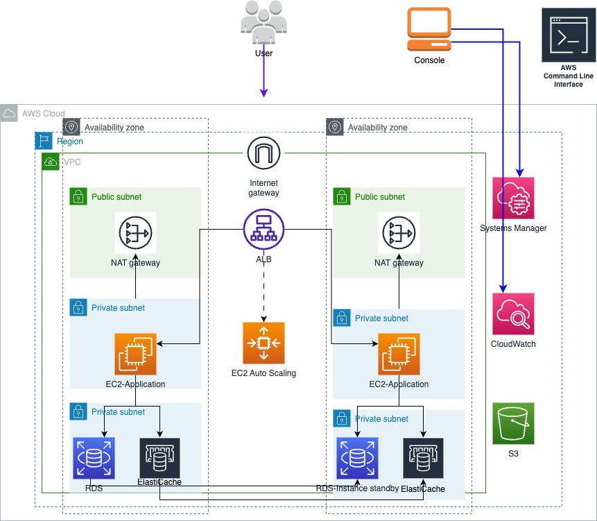

# 工程说明

这个工程是基于已有的VPC构建的，这个VPC分别有public子网与private子网，terraform datasouce aws_subnets通过 Tag查找: Tier = "Public" / Tier = "Private"

## 架构图


## 前置条件

私有子网即Private subnets必须配置NAT网关用来访问internet否则无法下载Nginx, 及cloudwatch agent/ssm agent等安装包

## 设置的变量

- vpc_id:  配置为您的VPC ID
- app_inst_type: 启动模版的EC2 instance机型，可以用默认的t3.medium
- security_group_id_instance: 配置您EC2所在的安全组，允许来自ELB的访问
- security_group_id_lb: 配置您ELB所在的安全组允许internet端的流量及http协议

## 资源清单

- aws_iam_role 配置EC2的IAM Role，这边的实例要求授权对SSM，Cloudwatch,S3的部分策略，通过SSM回话管理登录instance, cloudwatch配置监控与日志采集，S3允许getobject 获取如应用程序二进制包
- aws_ami  datasouce 定义AMI，这边选择是Amazon Linux 2 X86-64
- aws_launch_template  定义一个Nginx 的启动模版，定义了机型等基础配置，此外通过userdata定义Nginx的安装
- aws_autoscaling_group 配置自动伸缩组关联启动模版, 我们指定在创建中关联新的ALB并配置监听配置及新的目标组的关联

## Userdata 说明

```json
  user_data = base64encode(templatefile("${path.module}/cloud-init.yml", {
    version    = "1.1"
  }))
```

这边Userdata 通过cloud-init的方式进行加载， 我们这边分别安装了cloudwatch agent, systems manager agent , 及我们部署的应用nginx
