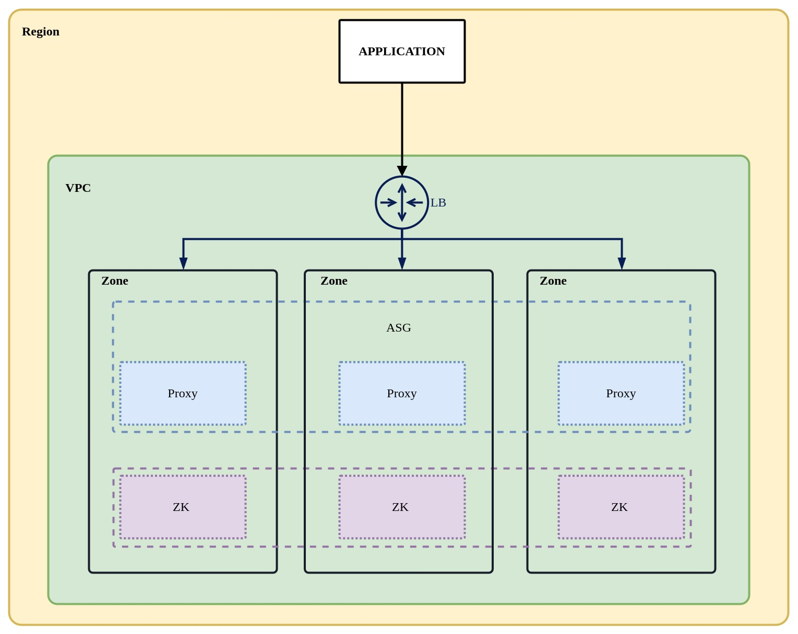

# Terraform Module for Apache ShardingSphere-Proxy Cluster

A terraform module to create an Apache ShardingSphere Proxy Cluster on AWS.

Terraform will create a cluster with the following architecture:



## Prerequisites

* Terraform CLI
* AWS Resource
  * 安装AWS CLI 配置为AK/SK分配好IAM权限
  * 一个内部ss-proxy的域名 默认`shardingsphere.org`
  * 提供VPC，并至少垮两个AZ的子网，子网必须要能outbound访问到internet下载安装包
  * 安全组inbound的端口 2888, 3888, , 2181
  * 提供ssh keypair

## Usage

Step1: Edit `main.tf`

```hcl
terraform {
  required_providers {
    aws = {
      source  = "hashicorp/aws"
      version = "4.37.0"
    }
  }
}

provider "aws" {
  region     = "ap-southeast-1"
}

module "zk" {
  source              = "./modules/zk"
  cluster_size        = 3
  key_name            = "test-tf"
  instance_type       = "t2.nano"
  vpc_id              = "vpc-0ef2b7440d3ade8d5"
  subnet_ids          = ["subnet-0f388a6f23063b8c9", "subnet-0bc2cd85facb5ca06", "subnet-009077567350ef1b7"]
  security_groups     = ["sg-008e74936b3f9de19"]
}

module "shardingsphere" {
  depends_on             = [module.zk]
  source                 = "./modules/shardingsphere"
  cluster_size           = 3
  shardingsphere_version = "5.2.1"
  key_name               = "test-tf"
  image_id               = "ami-094bbd9e922dc515d"
  instance_type          = "t3.medium"
  lb_listener_port       = 3307
  vpc_id                 = "vpc-0ef2b7440d3ade8d5"
  subnet_ids             = ["subnet-0f388a6f23063b8c9", "subnet-0bc2cd85facb5ca06", "subnet-009077567350ef1b7"]
  security_groups     = ["sg-008e74936b3f9de19"]
  zk_servers             = module.zk.zk_node_domain
}
```

Step2: Set environments for AK/SK

```shell
export AWS_ACCESS_KEY_ID="accesskey"
export AWS_SECRET_ACCESS_KEY="secretkey"
```
or
[Install AWS CLI](https://docs.aws.amazon.com/cli/latest/userguide/getting-started-install.html) 
Step3: Initial Terraform working directory

```shell
terrafrom init
```

Step4: Run the command `terraform plan` to generates a execution plan.
Step5: Run the command `terraform apply` to crates your defined infrastructure.

***By default, Terraform will create a domain `proxy.[ZONE NAME]` is used by other services.***

***If you want to delete, you can run the command `terraform destroy`, Terraform will destroy your defined infrastructure.***

## Modules

### Requirements

| Name                                   | Version |
| -------------------------------------- | ------- |
| `<a name="requirement_aws"></a>` aws | 4.37.0  |

### Modules

| Name                                                                    | Source           | Version |
| ----------------------------------------------------------------------- | ---------------- | ------- |
| `<a name="module_zk"></a>` [zk](#ZK)                                     | ./zk             | n/a     |
| `<a name="module_shardingsphere"></a>` [shardingsphere](#shardingsphere) | ./shardingsphere | n/a     |

### Outputs

| Name                                                                                                   | Description                                                                   |
| ------------------------------------------------------------------------------------------------------ | ----------------------------------------------------------------------------- |
| `<a name="output_shardingsphere_domain"></a>` [shardingsphere\_domain](#output\_shardingsphere\_domain) | The domain name of the ShardingSphere Proxy Cluster for use by other services |
| `<a name="output_zk_node_domain"></a>` [zk\_node\_domain](#output\_zk\_node\_domain)                    | The domain of zookeeper instances                                             |

### ZK

#### Resources

| Name                                                                                                                               | Type        |
| ---------------------------------------------------------------------------------------------------------------------------------- | ----------- |
| [aws_instance.zk](https://registry.terraform.io/providers/hashicorp/aws/latest/docs/resources/instance)                               | resource    |
| [aws_network_interface.zk](https://registry.terraform.io/providers/hashicorp/aws/latest/docs/resources/network_interface)             | resource    |
| [aws_route53_record.zk](https://registry.terraform.io/providers/hashicorp/aws/latest/docs/resources/route53_record)                   | resource    |
| [aws_ami.base](https://registry.terraform.io/providers/hashicorp/aws/latest/docs/data-sources/ami)                                    | data source |
| [aws_availability_zones.available](https://registry.terraform.io/providers/hashicorp/aws/latest/docs/data-sources/availability_zones) | data source |
| [aws_route53_zone.zone](https://registry.terraform.io/providers/hashicorp/aws/latest/docs/data-sources/route53_zone)                  | data source |

#### Inputs

| Name                                                                                    | Description                                                                                                                                                                                                                  | Type             | Default                                                                               | Required |
| --------------------------------------------------------------------------------------- | ---------------------------------------------------------------------------------------------------------------------------------------------------------------------------------------------------------------------------- | ---------------- | ------------------------------------------------------------------------------------- | :------: |
| `<a name="input_cluster_size"></a>` [cluster\_size](#input\_cluster\_size)               | The cluster size that same size as available\_zones                                                                                                                                                                          | `number`       | n/a                                                                                   |   yes   |
| `<a name="input_hosted_zone_name"></a>` [hosted\_zone\_name](#input\_hosted\_zone\_name) | The name of the hosted private zone.The AWS private 'hosted_zone' must be created first, and the private zone is associated with the VPC, so the variable 'vpcid' must be matched to find the matching 'route53_hosted_zone' | `string`       | `"shardingsphere.org"`                                                              |    no    |
| `<a name="input_instance_type"></a>` [instance\_type](#input\_instance\_type)            | The EC2 instance type                                                                                                                                                                                                        | `string`       | n/a                                                                                   |   yes   |
| `<a name="input_key_name"></a>` [key\_name](#input\_key\_name)                           | The ssh keypair for remote connection                                                                                                                                                                                        | `string`       | n/a                                                                                   |   yes   |
| `<a name="input_security_groups"></a>` [security\_groups](#input\_security\_groups)      | List of the Security Group, it must be allow access 2181, 2888, 3888 port                                                                                                                                                    | `list(string)` | `[]`                                                                                |    no    |
| `<a name="input_subnet_ids"></a>` [subnet\_ids](#input\_subnet\_ids)                     | List of subnets sorted by availability zone in your VPC                                                                                                                                                                      | `list(string)` | n/a                                                                                   |   yes   |
| `<a name="input_tags"></a>` [tags](#input\_tags)                                         | A map of zk instance resource, the default tag is Name=zk-${count.idx}                                                                                                                                                       | `map(any)`     | `{}`                                                                                |    no    |
| `<a name="input_vpc_id"></a>` [vpc\_id](#input\_vpc\_id)                                 | The id of VPC                                                                                                                                                                                                                | `string`       | n/a                                                                                   |   yes   |
| `<a name="input_zk_config"></a>` [zk\_config](#input\_zk\_config)                        | The default config of zookeeper server                                                                                                                                                                                       | `map`          | `<pre>`{`<br>`  "client_port": 2181,`<br>`  "zk_heap": 1024 `<br>`}`</pre>` |    no    |
| `<a name="input_zk_version"></a>` [zk\_version](#input\_zk\_version)                     | The zookeeper version                                                                                                                                                                                                        | `string`       | `"3.7.1"`                                                                           |    no    |

#### Outputs

| Name                                                                                              | Description |
| ------------------------------------------------------------------------------------------------- | ----------- |
| `<a name="output_zk_node_domain"></a>` [zk\_node\_domain](#output\_zk\_node\_domain)               | n/a         |
| `<a name="output_zk_node_private_ip"></a>` [zk\_node\_private\_ip](#output\_zk\_node\_private\_ip) | n/a         |

### shardingsphere

#### Resources

| Name                                                                                                                                            | Type        |
| ----------------------------------------------------------------------------------------------------------------------------------------------- | ----------- |
| [aws_autoscaling_attachment.asg_attachment_lb](https://registry.terraform.io/providers/hashicorp/aws/latest/docs/resources/autoscaling_attachment) | resource    |
| [aws_autoscaling_group.ss](https://registry.terraform.io/providers/hashicorp/aws/latest/docs/resources/autoscaling_group)                          | resource    |
| [aws_launch_template.ss](https://registry.terraform.io/providers/hashicorp/aws/latest/docs/resources/launch_template)                              | resource    |
| [aws_lb.ss](https://registry.terraform.io/providers/hashicorp/aws/latest/docs/resources/lb)                                                        | resource    |
| [aws_lb_listener.ss](https://registry.terraform.io/providers/hashicorp/aws/latest/docs/resources/lb_listener)                                      | resource    |
| [aws_lb_target_group.ss_tg](https://registry.terraform.io/providers/hashicorp/aws/latest/docs/resources/lb_target_group)                           | resource    |
| [aws_network_interface.ss](https://registry.terraform.io/providers/hashicorp/aws/latest/docs/resources/network_interface)                          | resource    |
| [aws_route53_record.ss](https://registry.terraform.io/providers/hashicorp/aws/latest/docs/resources/route53_record)                                | resource    |
| [aws_availability_zones.available](https://registry.terraform.io/providers/hashicorp/aws/latest/docs/data-sources/availability_zones)              | data source |
| [aws_route53_zone.zone](https://registry.terraform.io/providers/hashicorp/aws/latest/docs/data-sources/route53_zone)                               | data source |
| [aws_vpc.vpc](https://registry.terraform.io/providers/hashicorp/aws/latest/docs/data-sources/vpc)                                                  | data source |

#### Inputs

| Name                                                                                                    | Description                                             | Type             | Default                  | Required |
| ------------------------------------------------------------------------------------------------------- | ------------------------------------------------------- | ---------------- | ------------------------ | :------: |
| `<a name="input_cluster_size"></a>` [cluster\_size](#input\_cluster\_size)                               | The cluster size that same size as available\_zones     | `number`       | n/a                      |   yes   |
| `<a name="input_hosted_zone_name"></a>` [hosted\_zone\_name](#input\_hosted\_zone\_name)                 | The name of the hosted private zone                     | `string`       | `"shardingsphere.org"` |    no    |
| `<a name="input_image_id"></a>` [image\_id](#input\_image\_id)                                           | The AMI id                                              | `string`       | n/a                      |   yes   |
| `<a name="input_instance_type"></a>` [instance\_type](#input\_instance\_type)                            | The EC2 instance type                                   | `string`       | n/a                      |   yes   |
| `<a name="input_key_name"></a>` [key\_name](#input\_key\_name)                                           | the ssh keypair for remote connection                   | `string`       | n/a                      |   yes   |
| `<a name="input_lb_listener_port"></a>` [lb\_listener\_port](#input\_lb\_listener\_port)                 | lb listener port                                        | `string`       | n/a                      |   yes   |
| `<a name="input_security_groups"></a>` [security\_groups](#input\_security\_groups)                      | List of The Security groups                             | `list(string)` | `[]`                   |    no    |
| `<a name="input_shardingsphere_version"></a>` [shardingsphere\_version](#input\_shardingsphere\_version) | The shardingsphere version                              | `string`       | n/a                      |   yes   |
| `<a name="input_subnet_ids"></a>` [subnet\_ids](#input\_subnet\_ids)                                     | List of subnets sorted by availability zone in your VPC | `list(string)` | n/a                      |   yes   |
| `<a name="input_vpc_id"></a>` [vpc\_id](#input\_vpc\_id)                                                 | The id of your VPC                                      | `string`       | n/a                      |   yes   |
| `<a name="input_zk_servers"></a>` [zk\_servers](#input\_zk\_servers)                                     | The Zookeeper servers                                   | `list(string)` | n/a                      |   yes   |

#### Outputs

| Name                                                                                                   | Description                                                                   |
| ------------------------------------------------------------------------------------------------------ | ----------------------------------------------------------------------------- |
| `<a name="output_shardingsphere_domain"></a>` [shardingsphere\_domain](#output\_shardingsphere\_domain) | The domain name of the ShardingSphere Proxy Cluster for use by other services |
