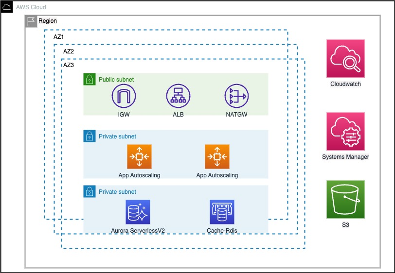
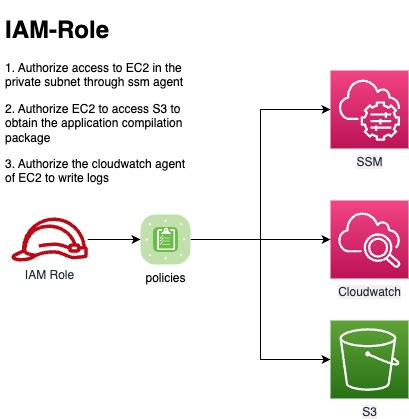

# Use Terraform to build a classic three-tier architecture stack

* Terraform will create below resources
  * VPC
  * Application Load Balancer
  * Public & Private Subnets
  * EC2 instances
  * RDS instance
  * ElastiCache
  * AutoScalingGroup
  * Internet Gateway
  * Security Groups for Web & IAM Role
  * Route Table
